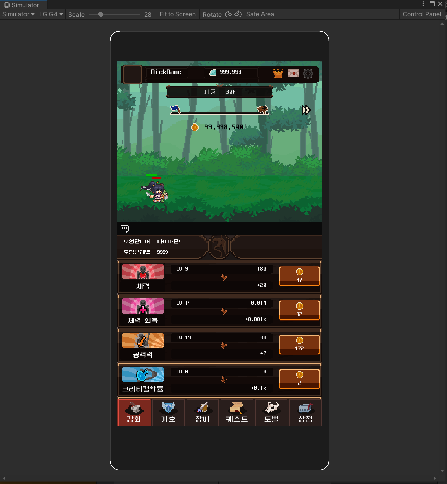
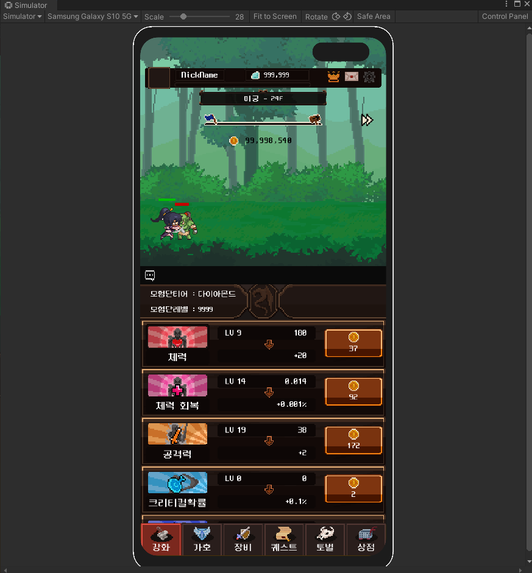
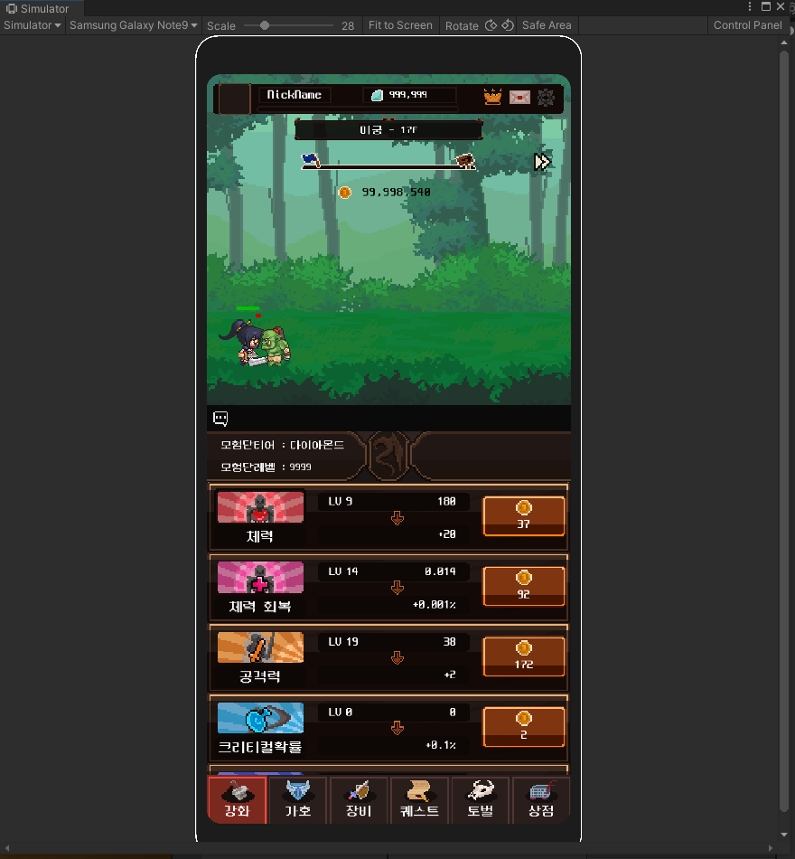
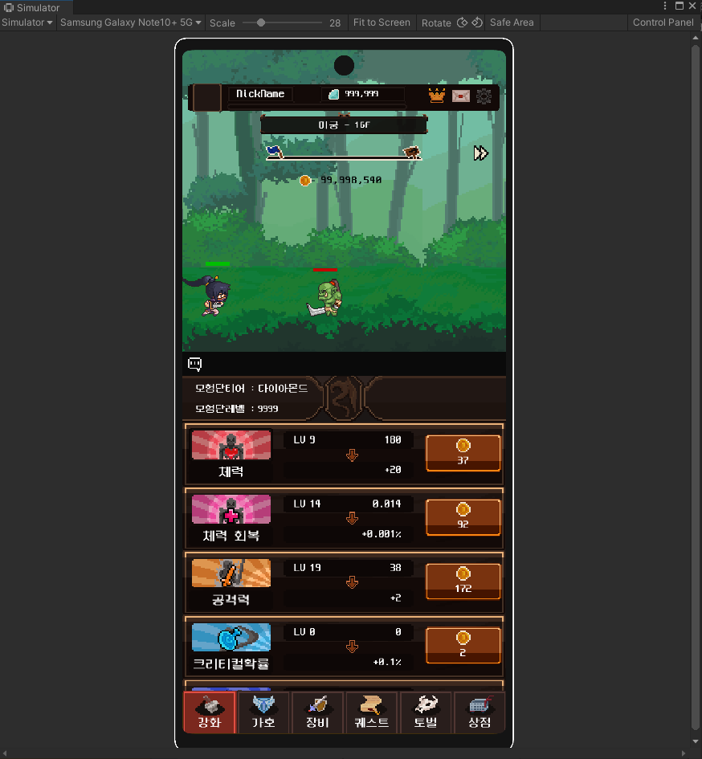

# 키우기 게임
 이 프로젝트는 더미 리소스들을 활용하여 UGUI를 사용하여 모바일기기 해상도 대응을 연습하기 위한 프로젝트입니다.     
 
 -----
 ### 어떤 게임인가
    
    게임명 : 미정
    타겟 플랫폼 : Android (미출시)
    사용언어, 엔진 : C#, Unity
    
</img></img>
</img></img>

 ** 게임 소개 **
 > 방치형 키우기 게임으로 몬스터를 잡아 얻은 골드와 귀환(환생)으로 얻은 재화를 사용하여 캐릭터를 강화합니다.
 
 ** 제작 목적 / 방법 **
 > Unity UGUI를 사용하여 모바일 디바이스의 다양한 해상도에 대응하는 UI를 배치하기 위하여 제작된 연습용 프로젝트입니다.     
 > Unity에 새로 추가된 **Device Simulator**를 사용하여 각종 기기 별 해상도를 편리하게 확인, 수정하였습니다.     
 > Safe Area 를 잘라낸 UI를 미리보기위하여 무료에셋 CrystalFrameWork를 사용했습니다.     
